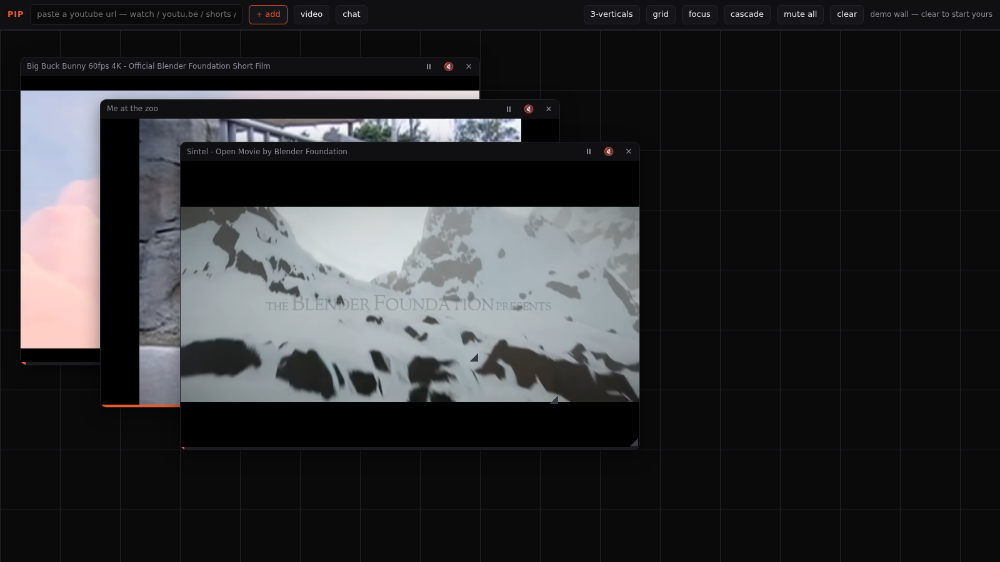

# PIP — masonry multiview for YouTube

A wall of viewports instead of one centered video. Watch 3 verticals at once,
solo one audio, ignore the algorithm entirely.



## What it is

- **Panes, not a page.** Each video is a free-floating viewport on a canvas.
  Drag the header to move, grab the corner to resize, double-click header to
  maximize. The layout is yours; nothing recenters itself.
- **Click-to-solo audio.** Everything loads muted (the mute-wall). Click a
  pane → it's the only one you hear. Click again → back to silence.
- **Presets:** `3-verticals` (9:16 columns — the phone-native default),
  `grid`, `focus` (one big + rail), `cascade`.
- **Persistence.** Panes + geometry live in localStorage; reload and the wall
  is still yours.
- **Per-pane chrome:** play/pause, seek bar, live title, close. Videos that
  refuse embedding get flagged with a badge instead of pretending to work.
- **Chat pane (v1.1).** Toggle `chat`, paste a live/upcoming stream URL →
  the stream's live chat becomes just another viewport (dark theme, real
  scroll, can send if you're logged into YouTube). Chat panes are
  kind-aware in persistence and exempt from the audio model.
- **v1.2 — containers, not just players.**
  - Drop a URL on empty canvas → new pane right there. Drop it *on a
    pane* → that container is reused in place.
  - Drag one pane's header onto another → they swap slots (dragged snaps
    into the target's cell; the displaced one takes the drag's origin).
  - **◎** picks the focused pane (big cell + rail, remembered across
    reloads); double-click header still maximizes.
  - **✎** rearms a container: next URL pasted in the box replaces it.
  - Beyond YouTube: Twitch channels/clips/videos, Vimeo, direct video
    files (mp4/webm/ogg), and any page that allows embedding — one URL
    box, auto-detected. Sites that send `X-Frame-Options: DENY` can't be
    framed by anyone; they get a hint badge.
- **Rotate without dragging (v1.3).** `⟲`/`⟳` — or just the arrow keys —
  rotate contents across the wall's slots in reading order. The shape
  never changes, players keep playing through it, and the whole class of
  drag bugs is structurally impossible. Dragging stays for freeform
  shaping; rotation is the one-click everyday move.
  - `clear` truly empties the wall; the demo is its own `demo` button.

## Run it

**Or don't — it's deployed:** https://pip-multiview.pages.dev

Found something broken? [Open an issue](https://github.com/behole/pip-multiview/issues) — real feedback welcome.

```sh
cd ~/workspace/PIP
python3 -m http.server 8321 --bind 0.0.0.0
```

- On the box: http://127.0.0.1:8321
- Over Tailscale: http://100.70.136.106:8321 (or
  pop-os.warthog-clownfish.ts.net:8321)

`file://` won't work — the YouTube IFrame API needs a real origin. Cap is 6
panes; each iframe is a full YouTube player and they add up.

## The companion theme

`youtube.user.css` — Stylus theme for youtube.com itself: `--yt-spec-*`
palette overrides (accent `#f05a28`) + toggles for hide-Shorts,
hide-home-recs, hide-comments, calm-grid. Install via Stylus (live-reload on
a `file://` install; bump `@version` + push for auto-update from a raw
GitHub URL).

## Test

```sh
python3 test_pip.py   # headless Chrome; serves the folder itself and drives the core features
```

## v1 boundary, on purpose

No search (paste URLs only), no account sync, no backend, no telemetry.
The player is YouTube's embed; the layout, the audio model, and the
reasons-to-visit are yours.

## Ideas on deck

- Right-click context menu: add pane at cursor, per-pane actions (solo/focus/reuse/remove)
- Search pane (Data API, 100 free queries/day)
- Channel → active-stream auto-resolve for chat panes (1-quota API call)
- Document PiP pop-out of the whole wall
